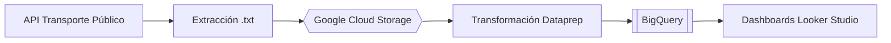
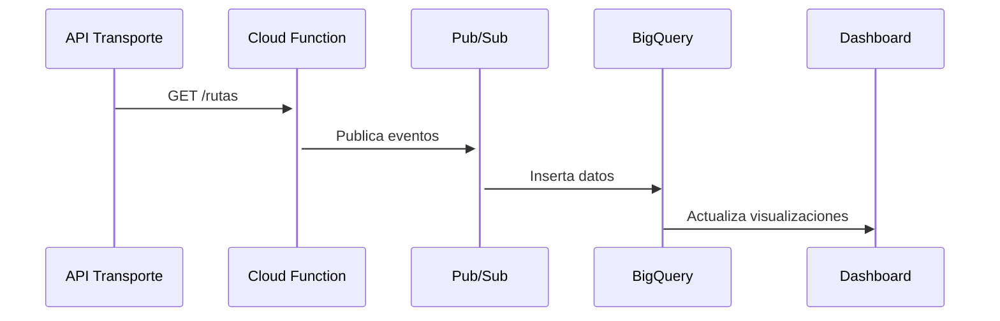
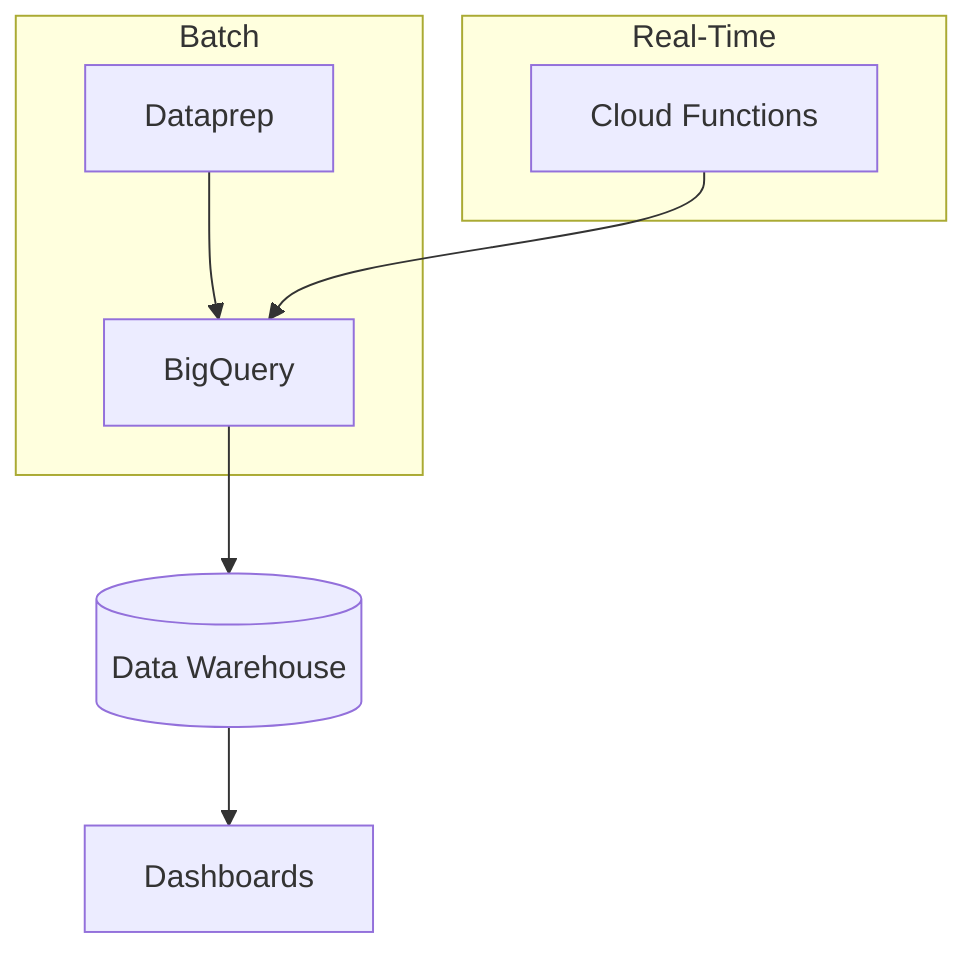

# 📊 Informe Técnico: Sistema de Análisis de Transporte Público

## Colaboradores: @matias-bello-rodriguez & @residente

## 📌 Informe N°2 - Arquitectura Batch

### 🔍 Objetivo

Procesamiento eficiente de datos históricos del transporte público para identificar patrones y optimizar rutas.

### 🛠 Arquitectura



#### 🔧 Proceso ETL

**Extracción:**
- Descarga de datos GTFS en formato `.txt`
- Conversión manual a CSV

**Transformación:**
```python
# Ejemplo limpieza con Dataprep
df = df.dropDuplicates()
df['fecha'] = df['fecha_string'].toDate('dd/MM/yyyy')
```

**Carga:**
- Dataset transporte en BigQuery
- 12 tablas relacionadas

### 📈 Consultas Relevantes
```sql
-- Top paradas más utilizadas
SELECT stop_name, COUNT(*) as frecuencia 
FROM `dataset.paraderos`
GROUP BY stop_name
ORDER BY frecuencia DESC
LIMIT 5;
```

### 📊 Resultados Batch

| Métrica              | Valor   |
|----------------------|---------|
| Paradas analizadas   | 15,682  |
| Rutas procesadas     | 342     |
| Horario pico         | 00:06-00:07 |

---

## ⚡ Informe N°3 - Arquitectura Real-Time

### 🎯 Objetivo

Monitoreo en tiempo real del estado del transporte público.

### 🌐 Arquitectura



#### 🔄 Flujo Automatizado

**Trigger:**
```bash
gcloud scheduler jobs create pubsub actualizacion-diaria \
  --schedule="0 0 * * *" \
  --topic=rutas-diarias
```

**Procesamiento:**
```python
# Cloud Function main.py
def rutas_diarias(event, context):
	response = requests.get(API_URL)
	data = transform_data(response.json())
	insert_bigquery(data)
```

### 📌 Estructura Datos
```sql
CREATE TABLE `transporte.real_time` (
  ruta_id STRING,
  paradero_id STRING,
  timestamp TIMESTAMP,
  ocupacion INT64
) PARTITION BY DATE(timestamp);
```

### 📈 KPIs en Tiempo Real
- Ocupación por ruta (actualización minuto a minuto)
- Tiempos de espera por paradero
- Flujo de pasajeros

---

## 🔗 Integración de Sistemas



---

## 📋 Conclusiones Comparativas

| Característica   | Batch             | Real-Time           |
|------------------|-------------------|---------------------|
| Frecuencia       | Diaria            | Continua            |
| Latencia         | 24h               | <5min               |
| Costo            | $$$               | $$                  |
| Casos de Uso     | Análisis histórico| Monitoreo operacional|

> **Nota:** Documentación completa disponible en los informes originales

---

## Tecnologías


---

**Autores:** Matías Bello - Bastián Olivares  
**Asignatura:** Big Data - Sección 002D  
**Profesor:** Leonardo Hernández  
**Institución:** DUOC UC  
**Fecha:** 2023
